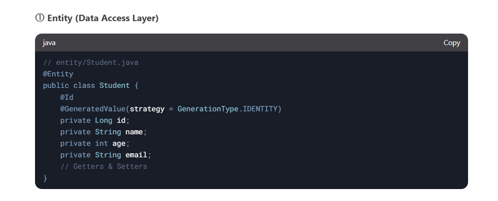
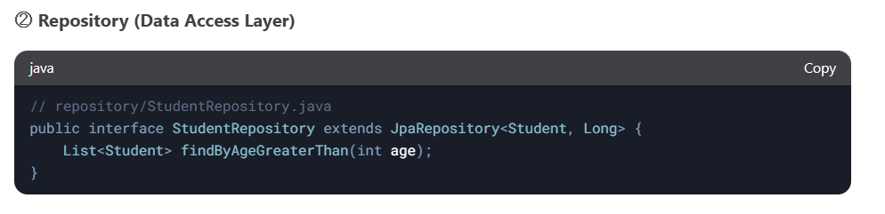
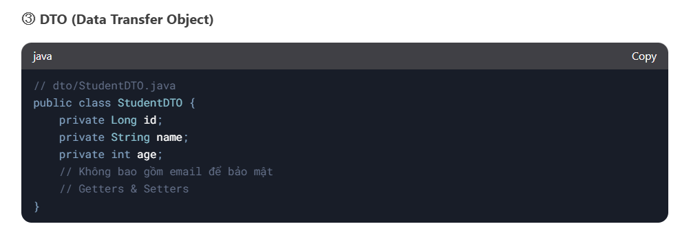
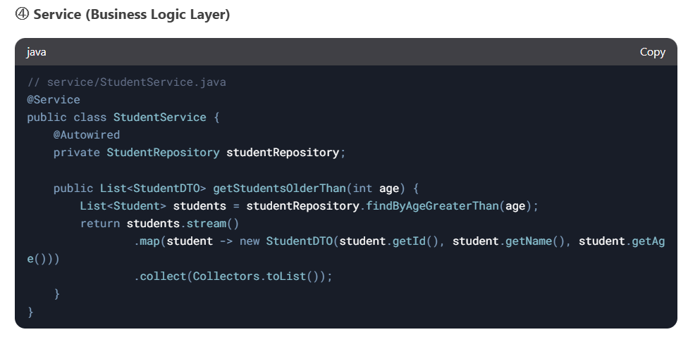
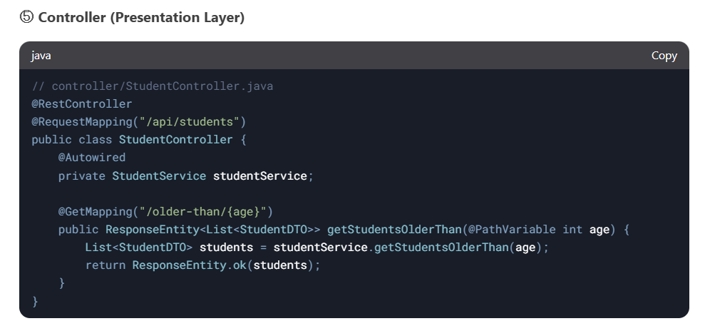

# JAVA2025
# Cập nhật tuần 11:
- Tạo 3 lớp BUS, DAO, GUI ứng với mô hình ba lớp.

# Tuần 12:
① Presentation Layer (Tầng Hiển Thị)
Vai trò: Hiển thị dữ liệu và nhận input từ người dùng (Web, Mobile, Desktop).

Công nghệ: HTML/CSS/JS (Frontend), Thymeleaf, JSP, React, Android, Swing...

Không chứa logic nghiệp vụ, chỉ gọi Service Layer.

② Business Logic Layer (Tầng Nghiệp Vụ)
Vai trò: Xử lý các quy tắc nghiệp vụ (ví dụ: validation, tính toán).

Thành phần:

Service: Chứa logic chính (ví dụ: UserService, OrderService).

DTO: Đối tượng truyền dữ liệu giữa các tầng.

③ Data Access Layer (Tầng Truy Xuất Dữ Liệu)
Vai trò: Làm việc trực tiếp với database (CRUD).

Thành phần:

Repository/DAO: Ví dụ: UserRepository, OrderDAO.

Entity: Đối tượng ánh xạ từ bảng database (ví dụ: User, Product).
Ví dụ:

## LƯU Ý QUAN TRỌNG YÊU CẦU THÀNH VIÊN ĐỌC:
Đề xuất: Bắt đầu từ tầng Entity và phát triển từ dưới lên
1. Tầng Entity (Database Entities):
Đây là tầng thấp nhất, đại diện cho cấu trúc dữ liệu trong cơ sở dữ liệu (ví dụ: bảng Book, User, BorrowRecord trong quản lý thư viện).
Bạn nên bắt đầu từ đây vì các tầng khác (như Repository, Service) sẽ phụ thuộc vào các entity này.
Ví dụ: Định nghĩa các lớp như Book với các thuộc tính id, title, author, isbn, v.v.
2. Tầng DTO (Data Transfer Objects):
Sau khi có Entity, bạn có thể định nghĩa DTO để chuyển đổi dữ liệu giữa các tầng (Entity thường không nên truyền trực tiếp lên Controller).
Ví dụ: BookDTO có thể chỉ chứa các trường cần thiết để giao tiếp với client, loại bỏ các thông tin nhạy cảm hoặc không cần thiết.
3. Tầng Repository (Data Access Layer):
Tiếp theo, viết các lớp Repository để xử lý truy vấn cơ sở dữ liệu (thường sử dụng JPA hoặc một ORM).
Repository sẽ làm việc trực tiếp với Entity, ví dụ: BookRepository với các phương thức như findById, save, findByAuthor.
4. Tầng Service (Business Logic Layer):
Sau khi Repository hoàn thiện, bạn có thể viết Service để xử lý logic nghiệp vụ.
Service gọi Repository(DAO) và thực hiện các quy tắc kinh doanh, ví dụ: kiểm tra sách có sẵn trước khi cho mượn.
5. Tầng Controller (Presentation Layer):
Cuối cùng, viết Controller để nhận yêu cầu từ client (qua API) và trả về kết quả.
Controller sẽ gọi Service và sử dụng DTO để giao tiếp, ví dụ: một endpoint /books để lấy danh sách sách.