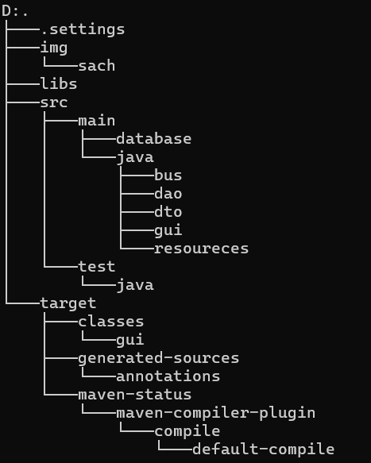

# JAVA2025
# Cập nhật tuần 11:
- Tạo 3 lớp BUS, DAO, GUI ứng với mô hình ba lớp.

# Tuần 12:
① Presentation Layer (Tầng Hiển Thị)
Vai trò: Hiển thị dữ liệu và nhận input từ người dùng (Web, Mobile, Desktop).

Công nghệ: HTML/CSS/JS (Frontend), Thymeleaf, JSP, React, Android, Swing...

Không chứa logic nghiệp vụ, chỉ gọi Service Layer.

② Business Logic Layer (Tầng Nghiệp Vụ)
Vai trò: Xử lý các quy tắc nghiệp vụ (ví dụ: validation, tính toán).

Thành phần:

Service: Chứa logic chính (ví dụ: UserService, OrderService).

DTO: Đối tượng truyền dữ liệu giữa các tầng.

③ Data Access Layer (Tầng Truy Xuất Dữ Liệu)
Vai trò: Làm việc trực tiếp với database (CRUD).

# Lưu ý quan trọng:
- Viết theo mô hình ba lớp GUI->BUS->DAO->DATABASE
- Để hiển thị dữ liệu thì BUS->DAO->BUS->GUI
- DTO là nơi lưu các thuộc tính
- AE viết chuẩn theo cái demo cho từng lớp, viết sai lần đầu: cảnh cáo, lần 2: -5%.
- GUI để tải giao diện hiển thị và cho người dùng tương tác.
- BUS nơi xử lý logic, kiểm tra trước khi đưa vào dữ liệu.
- DAO làm việc vơi DB, tui có viết sẵn một lớp connectDB, anh em muốn connect đến db thì gọi lớp này chứ không có tạo lại lớp connect trong DAO. Viết DAO dưới dạng preparetation không được viết excute bình thường.