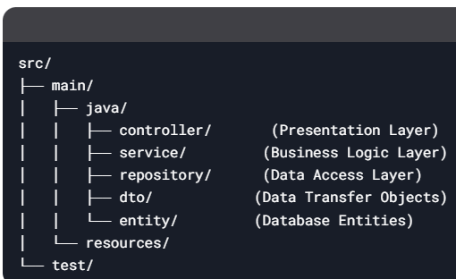

# JAVA2025
# Cập nhật tuần 11:
- Tạo 3 lớp BUS, DAO, GUI ứng với mô hình ba lớp.

# Tuần 12:
① Presentation Layer (Tầng Hiển Thị)
Vai trò: Hiển thị dữ liệu và nhận input từ người dùng (Web, Mobile, Desktop).

Công nghệ: HTML/CSS/JS (Frontend), Thymeleaf, JSP, React, Android, Swing...

Không chứa logic nghiệp vụ, chỉ gọi Service Layer.

② Business Logic Layer (Tầng Nghiệp Vụ)
Vai trò: Xử lý các quy tắc nghiệp vụ (ví dụ: validation, tính toán).

Thành phần:

Service: Chứa logic chính (ví dụ: UserService, OrderService).

DTO: Đối tượng truyền dữ liệu giữa các tầng.

③ Data Access Layer (Tầng Truy Xuất Dữ Liệu)
Vai trò: Làm việc trực tiếp với database (CRUD).

Thành phần:

Repository/DAO: Ví dụ: UserRepository, OrderDAO.

Entity: Đối tượng ánh xạ từ bảng database (ví dụ: User, Product).
Ví dụ:

